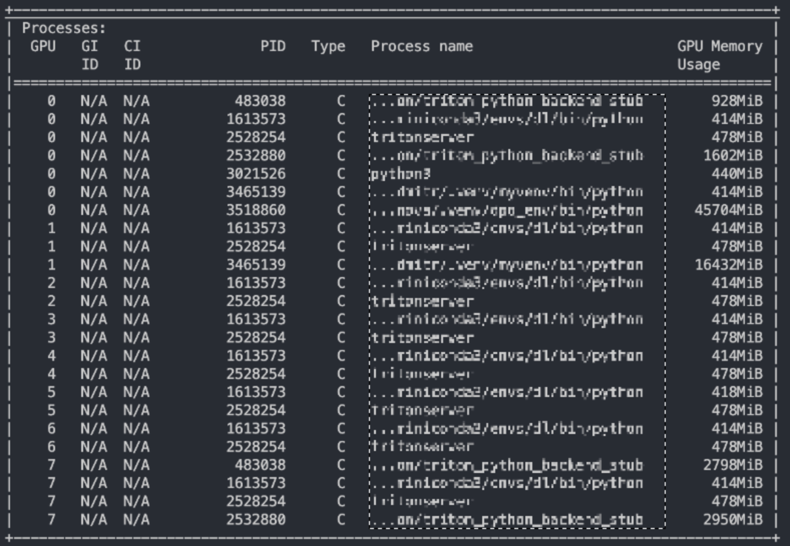

# GPU Zombie Reaper 💀⚔️

A merciless terminator of wasted GPU VRAM.

## 🧟 The Problem

Your GPU memory is full. But… nothing’s actually running.
Just undead processes shambling around, gnawing on your precious VRAM.



0% utilization. 100% audacity.

This tool puts them down. Permanently. ☠️

## ✨ Features

🔪 Kill processes with zero GPU utilization

🧟‍♂️ Terminate zombie processes

⏳ Reap processes older than X hours

🛡️ Dry-run mode for safety

🔓 Works with or without sudo

## 📦 Installation
### 🚀 Option 1: Install from source

```bash
git clone https://github.com/tytskiy/gpu-zombie-reaper.git
cd gpu-zombie-reaper
pip install -e .
```

### 🐍 Option 2: Clone + install requirements
```bash
git clone https://github.com/tytskiy/gpu-zombie-reaper.git
cd gpu-zombie-reaper
pip install -r requirements.txt
```

Copy, paste, and smite freely.

## ⚔️ Usage
### 💪 Gigachad Mode (Direct GPU Kill)

For absolute legends who run random GitHub scripts with sudo because fear is for CPUs. This mode doesn’t ask questions—it just yeets offending processes straight into the void.

sudo python3 -m gpu_zombie_reaper --zero-util

### 🛡️ Paranoid but Correct Mode

You trust nothing. Good.
Run safely and manually feed the PIDs to sudo:

```bash
python -m gpu_zombie_reaper --zero-util --fuser-output "$(sudo fuser -v /dev/nvidia* 2>/dev/null)" --output-pids \
    | xargs sudo kill -9
```

## 🧰 Options

`--dry-run` — Preview targets ☑️

`--zero-util` — Kill 0% util hogs

`--zombies` — Kill zombie processes

`--too-old HOURS` — Reap ancient processes

`--no-process` — Kill processes lacking system info

`--output-pids` — Output only PIDs (for no-sudo mode)

## 📝 Examples

### Preview

```bash
python -m gpu_zombie_reaper --zero-util --too-old 12 --dry-run
🔍 Gathering GPU process information...
✓ Found 6 GPU processes (after whitelist filtering)


════════════════════════════════════════════════════════════════════════════════════════
⚠️  ZERO GPU UTILIZATION
════════════════════════════════════════════════════════════════════════════════════════
  👁️  [DRY RUN] Would kill: PID 124264 anonym [python] GPU 7 |     414MB |   0% ⏱   27.5m 
    └─ /.../bin/python -m ipykernel_launcher --f=/run/user/392804/jupyter/ru...

👁️ Would kill 1 process(es)


════════════════════════════════════════════════════════════════════════════════════════
⏰  PROCESSES OLDER THAN 12 HOURS
════════════════════════════════════════════════════════════════════════════════════════

No processes matched this criteria


════════════════════════════════════════════════════════════════════════════════════════
👁️   TOTAL: Would kill 1 process(es)
   Run without --dry-run to actually kill the processes.
════════════════════════════════════════════════════════════════════════════════════════

```

### Others

```bash
# Preview what would be killed
sudo python3 -m gpu_zombie_reaper --zero-util --dry-run

# Kill old processes (older than 24 hours)
sudo python3 -m gpu_zombie_reaper --too-old 24

# Kill zombie processes
sudo python3 -m gpu_zombie_reaper --zombies

# Combine multiple criteria
sudo python3 -m gpu_zombie_reaper --zero-util --zombies --too-old 12

# Or run the script directly:
sudo python3 gpu_zombie_reaper.py --zero-util
```

## 📜 License

This project is licensed under the WTFPL.
Do. Whatever. You want. 🤘
